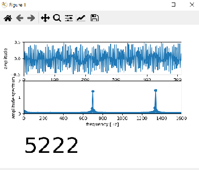

# HolaSusana 

HolaSusana se trata de un mini proyecto de verano, el cual consiste en demostrar como indirecta

# Inspiración

El disparador nació al ver un día una tonta publicación de facebook de alguna tia-abuela lejana en la cual mostraba como tocar el feliz cumpleaños con el teclado del teléfono. Si bien esto era algo viejísimo para mí me llevó a recordar que cada tecla tiene un sonido diferente, algunos más o menos parecidos al resto pero todas diferentes.

**Cumpleaños Feliz** 112163 112196 11#9632 969363

**La Lechuza** 12311231 369369 9#9631 9#9631 191 191

Luego de jugar con el teclado de mi celular (no tenia nada mejor que hacer en vacaciones), recordé que existia un programa de television en los cuales se llamaban a los televidentes para que estos ganen algun primio. En este programa la conductora, de recurrente fraces desafortunadas, marcaba el telefono de manera muy particular. Los números correspondientes a la caracteristicas los marcaba nombrandolos y los restantes los acompañaba con una onomatopeya. Para que logicamente el numero de telefono del ganador no se emita casi por cadena nacional. Lo que si se repoducia era el sonido que producia cada tecla. Esto me llevo a pensar que si, cada tecla es diferente y logro identificar el sonido caracteristico de cada una, podre conocer el numero de telefono que se marcó, ya que me lo estan diciendo en forma indirecta.

Video de Susana llamada  ====>   https://youtu.be/AzyD1nOsiIs?t=8

# Funcionamiento

El sonido tan caracteristicos de las teclas de los telefonos previenen de algo conocido como DTMF (Dual-Tone Multi-Frequency), es un sistema de marcación por tono que es usado para la señalizacion en comunicaciones sobre lineas analógicas en la banda de frecuencia vocal entre teléfonos u otros equipos de comunicaciones y la central telefónica. El sistema  fue propuesto en 1960.

Al ser pulsada en el teléfono la tecla correspondiente al dígito que quiere marcar, se envían dos tonos, de distinta frecuencia: uno por columna y otro por fila en la que esté la tecla, que la central decodifica a través de filtros especiales, detectando qué dígito se marcó.

# Test

Para confirmar el funcionamiento usé una aplicación de Android llamada _spectroid_ la cual hace de analizador de espectro y el teclado de llamadas.

Se observa como cuando se prueba una secuencia de botones horizontal (1 2 3) el tono mas bajo se mantiene quieto y el tono mayor varia. Cuando se prueba una secuencia vertical (1 2 3) el tono mas bajo varia y el tono mayor no.

Tambien se puede decir que el sonido producido por el teclado de los celulares actuales son iguales a los clasicos que los utilizados en  comunicaciones sobre lineas analógicas, aunque es totalmente innecesario, pero la razón debe ser una cuestión de tradición/costumbre (Como las cámaras digitales que reproducen el sonido de obturación).

# Implementacion

Se realizó un script que detecte los 2 pulsos emitidos de los 7 posible y segun la convinación discrimine que núumero fue presionado. Para esto la solución más fácil fue raalizar la fft sobre la señal de audio y analisar los valores de potencias correspondiente a estas frecuencias. 

Lo que hice fue utilizar(robar) un proyecto que realizaba la fft sobre la señal de audio de la entrada de microfono de la PC y modificarlo para evaluar los niveles de potencia, tambien se realizaron alguna excepciones para que no detecte como un botón apretado cuando alguien habla o se escucha cualquier otro sonido. 

