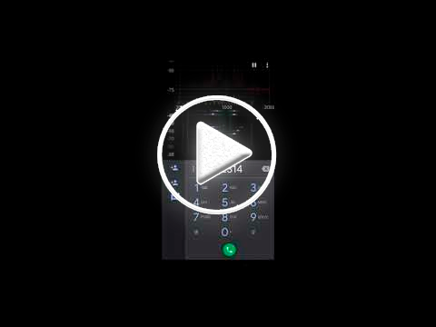
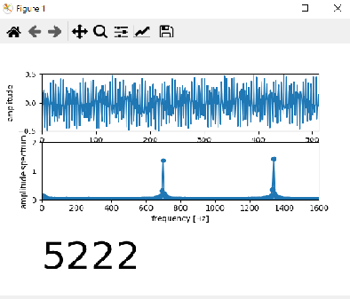
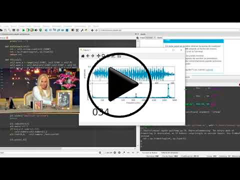

# HolaPysana 

HolaPysana se trata de un mini proyecto de verano, el cual consiste en demostrar como indirectamente cuando alguien marca por teléfono se puede conocer que números están siendo digitado, con tan solo escuchar el sonido producido por el aparato.

# Inspiración

El disparador nació al ver un día una tonta publicación de facebook de alguna tia-abuela lejana en la cual mostraba como tocar el feliz cumpleaños con el teclado de llamada del teléfono. Si bien esto era algo viejísimo para mí me llevó a recordar que cada tecla tiene un sonido diferente, algunos más o menos parecidos al resto, pero todas diferentes.

**Cumpleaños Feliz** 112163 112196 11#9632 969363

**La Lechuza** 12311231 369369 9#9631 9#9631 191 191

Luego de jugar con el teclado de mi celular (no tenía nada mejor que hacer en vacaciones), recordé que existía un programa de televisión en los cuales se llamaban a los televidentes para que estos ganen algún premio. En este programa la conductora, de recurrente frases desafortunadas, marcaba el teléfono de manera muy particular. Los números correspondientes a la característica los marcaba nombrándolos y los restantes los acompañaba con una onomatopeya. Para que lógicamente el número de teléfono del ganador no se emita casi por cadena nacional. Lo que si se reproducía era el sonido que producía cada tecla. Esto me llevo a pensar que sí, cada tecla es diferente (ya que se puede tocar una canción con estas) y si logro identificar el sonido característico de cada una, podre conocer el número de teléfono que se marcó, ya que me lo están diciendo en forma indirecta.

Video de Susana llamada  ====>   https://youtu.be/AzyD1nOsiIs?t=8

# Funcionamiento

El sonido tan característico de las teclas de los teléfonos previenen de algo conocido como DTMF (Dual-Tone Multi-Frequency), es un sistema de marcación por tono que es usado para la señalización en comunicaciones sobre líneas analógicas en la banda de frecuencia vocal entre teléfonos u otros equipos de comunicaciones y la central telefónica. El sistema fue propuesto en 1960.

Al ser pulsada en el teléfono la tecla correspondiente al dígito que quiere marcar, se envían dos tonos, de distinta frecuencia: uno por columna y otro por fila en la que esté la tecla, que la central decodifica a través de filtros especiales, detectando qué dígito se marcó.

# Test

Para confirmar el funcionamiento usé una aplicación de Android llamada _spectroid_ la cual hace de analizador de espectro y el teclado de llamadas.

**Video de demostración**

Se observa como cuando se prueba una secuencia de botones horizontal (1 2 3) el tono más bajo se mantiene quieto y el tono mayor varia. Cuando se prueba una secuencia vertical (1 2 3) el tono más bajo varia y el tono mayor no.

También se puede decir que el sonido producido por el teclado de los celulares actuales son iguales a los clásicos que los utilizados en comunicaciones sobre líneas analógicas, aunque es totalmente innecesario, pero la razón debe ser una cuestión de tradición/costumbre (Como las cámaras digitales que reproducen el sonido de obturación).

# Implementación

Como no cuento con oído absoluto y me es imposible discriminar entre los diferentes todos. Realicé un script que detecte los 2 pulsos emitidos de los 7 posible y según la combinación discrimine que número fue presionado. Para esto la solución más fácil fue realizar la fft sobre la señal de audio y analizar los valores de potencias correspondiente a estas frecuencias. 

Lo que hice fue utilizar(robar) un proyecto que realizaba la fft sobre la señal de audio de la entrada de micrófono de la PC y modificarlo para evaluar los niveles de potencia, también se realizaron alguna excepciones para que no detecte como un botón apretado cuando alguien habla o se escucha cualquier otro sonido.

# Resultados

Actualmente el sonido se toma de la entrada de micrófono de la PC, yo utilizo el micrófono de unos auriculares de un celular, ya que tuve mejore resultados que con el micro interno de la notebook. 

Lo probé marcando con mi teléfono celulares y los resultados son más que bueno, algunas veces el programa registra falsos positivos, pero en general el funcionamiento es satisfactorio.

Si bien el funcionamiento es muy bueno, se podría mejorar la detección pero la finalidad del proyecto era demostrar cómo, indirectamente, los programas de televisión nos "dicen" a que número de teléfono están marcando.

